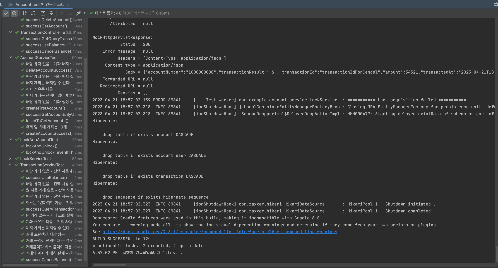

### JAEHYUN Account

## 📢 프로젝트 설명
- 제로베이스 부트캠프 백엔드 스쿨 10기 과제로 진행한 "Account 계좌 과제" 이다.

## ⚙ 개발 환경
- 운영체제 : MacOS
- 통합개발환경(IDE) : IntelliJ
- JDK 버전 : JDK 11
- 데이터 베이스 : H2
- 빌드 툴 : Gradle
- 관리 툴 : GitHub

## 🔌 Dependencies
- Spring Web
- Spring JPA
- Spring validation
- redisson
- embedded redis
- h2 database
- Lombok

## 💻 기술 스택
- 백엔드
    - JAVA, SpringBoot
- 데이터베이스
  - H2Database 
  
## 👋 프로젝트 소개
- Account(계좌) 시스템은 사용자와 계좌의 정보를 저장하고 있으며, 
외부 시스템에서 거래를 요청할 경우 거래 정보를 받아서 계좌에서 잔액을 거래금액만큼 줄이거나(결제), 
거래금액만큼 늘리는(결제 취소) 거래 관리 기능을 제공하는 시스템입니다.
- 구현의 편의를 위해 사용자 생성 등의 관리는 API로 제공하지 않고 프로젝트 시작 시 자동으로 데이터가 입력되도록 하며, 
계좌 추가/해지/확인, 거래 생성/거래 취소/거래 확인의 6가지 API를 제공합니다.
- 거래금액을 늘리거나 줄이는 과정에서 여러 쓰레드 혹은 인스턴스에서 같은 계좌에 접근할 경우 
동시성 이슈로 인한 lost update가 발생할 수 있으나 이 부분은 정상적으로 해결하였습니다.
- API Request body와 Response body는 json 타입으로 표현하였습니다.
- 각각의 API들은 각자의 요청과 응답 객체 구조를 갖습니다. 
(다만, 요청을 처리하다가 실패하는 경우의 응답은 공통된 구조를 갖도록 하였습니다.)
## 👾 API 설명
✅ 계좌 관련 API
1) 계좌 생성 
   a. 파라미터 : 사용자 아이디, 초기 잔액 
   b. 결과 
   i. 실패 : 사용자 없는 경우, 계좌가 10개(사용자당 최대 보유 가능 계좌) 인 경우 실패 응답 
   ii. 성공 
- 계좌번호는 100000000 부터 순차적으로 1씩 증가 
- 응답정보 : 사용자 아이디, 생성된 계좌 번호, 등록일시(LocalDateTime) 

2) 계좌 해지 
   a. 파라미터 : 사용자 아이디, 계좌 번호 
   b. 결과 
   i. 실패 : 사용자 없는 경우, 사용자 아이디와 계좌 소유주가 다른 경우, 계좌가 이미 해지 상태인 경우, 잔액이 있는 경우 실패 응답 
   ii. 성공 
- 응답 : 사용자 아이디, 계좌번호, 해지일시

3) 계좌 확인 
   a. 파라미터 : 사용자 아이디 
   b. 결과 
   i. 실패 : 사용자 없는 경우 실패 응답 
   ii. 성공 
- 응답 : (계좌번호, 잔액) 정보를 Json list 형식으로 응답 

✅ 거래(Transaction) 관련 API
1) 잔액 사용 
   a. 파라미터 : 사용자 아이디, 계좌 번호, 거래 금액 
   b. 결과 
   i. 실패 : 사용자 없는 경우, 사용자 아이디와 계좌 소유주가 다른 경우, 계좌가 이미 해지 상태인 경우, 
            거래금액이 잔액보다 큰 경우, 거래금액이 너무 작거나 큰 경우 실패 응답 
   ii. 성공 
- 응답 : 계좌번호, transaction_result, transaction_id, 거래금액, 거래일시 

2) 잔액 사용 취소 
   a. 파라미터 : transaction_id, 계좌번호, 거래금액 
   b. 결과 
   i. 실패 : 원거래 금액과 취소 금액이 다른 경우, 트랜잭션이 해당 계좌의 거래가 아닌경우 실패 응답 
   ii. 성공 
- 응답 : 계좌번호, transaction_result, transaction_id, 취소 거래금액, 거래일시 

3) 거래 확인 
   a. 파라미터 : transaction_id 
   b. 결과 
   i. 실패 : 해당 transaction_id 없는 경우 실패 응답 
   ii. 성공 
- 응답 : 계좌번호, 거래종류(잔액 사용, 잔액 사용 취소), transaction_result, transaction_id, 거래금액, 거래일시 
- 성공거래 뿐 아니라 실패한 거래도 거래 확인 가능 

## 🌝 느낀점
- 스프링과 JPA를 사용해서 웹에 대한 프로젝트를 만들다 바로 직전에 JAVA, RDB, JSP를 이용해서 프로젝트를 만들었더니 
    JAVA, RDB, JSP가 익숙해져서 스프링과 JPA에 대한 내용들을 조금씩 까먹어서 코드를 이해하며 코드를 작성하느라  
    애먹었었던 과제.. 꾸준히 공부해서 모든 언어에 익숙한 사람이 되고싶었다고 느꼈던 과제였다. 정보처리기사 실기 시험이 
    하루밖에 남지않아 힘들었으나.. 이제 남은시간은 모두 정보처리기사 공부를 다시 하러 가야겠다. 

ps.. 테스트코드 40개 통과 기념사진👍 
