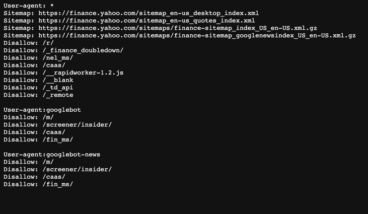

### JAEHYUN dividend

## 📢 프로젝트 설명
- 제로베이스 부트캠프 백엔드 스쿨 10기 과제로 진행한 "실전 배당금 프로젝" 이다.

## ⚙ 개발 환경
- 운영체제 : MacOS
- 통합개발환경(IDE) : IntelliJ
- JDK 버전 : JDK 11
- 데이터 베이스 : h2
- 빌드 툴 : Gradle 7.2
- 관리 툴 : GitHub

✅ 야후 파이낸스의 robots.md

