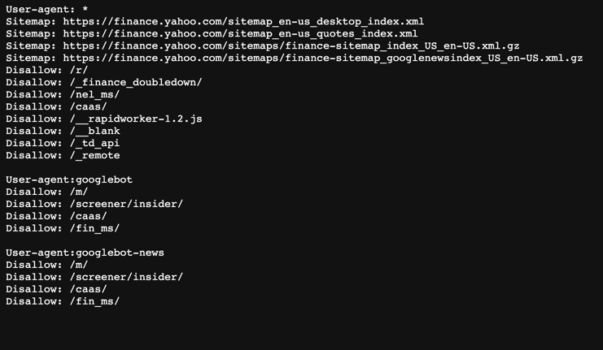
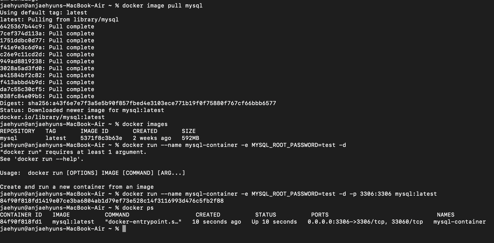

### JAEHYUN dividend

## 📢 프로젝트 설명
- 제로베이스 부트캠프 백엔드 스쿨 10기 과제로 진행한 "실전 배당금 프로젝트" 이다.

## ⚙ 개발 환경
- 운영체제 : MacOS
- 통합개발환경(IDE) : IntelliJ
- JDK 버전 : JDK 11
- 데이터 베이스 : h2
- 빌드 툴 : Gradle 7.2
- 관리 툴 : GitHub

## 🔌 Dependencies
- Spring Web
- Spring JPA
- Spring redis
- Spring security
- h2database
- jsoup
- jwt
- commons-collections4

## 💻 기술 스택
- 백엔드
    - JAVA, SpringBoot
- 데이터베이스
    - h2 

## 👾 프로젝트 설명
✅ 미국 주식 배당금 정보를 제공하는 API 서비스이다.

## 👾 API 설명
✅ GET - finance/dividend/{companyName}
- 회사 이름을 input으로 받아서 해당 회사의 메타 정보와 배당금 정보를 반환
- 잘못된 회사명이 입력으로 들어온 경우 400 status 코드와 에러메시지 반환

✅ GET - company/autocomplete
- 자동완성 기능을 위한 API
- 검색하고자 하는 prefix 를 입력으로 받고, 해당 prefix 로 검색되는 회사명 리스트 중 10개 반환

✅ GET - company
- 서비스에서 관리하고 있는 모든 회사 목록을 반환
- 반환 결과는 Page 인터페이스 형태

✅ POST - company
- 새로운 회사 정보 추가
- 추가하고자 하는 회사의 ticker 를 입력으로 받아 해당 회사의 정보를 스크래핑하고 저장
- 이미 보유하고 있는 회사의 정보일 경우 400 status 코드와 적절한 에러 메시지 반환
- 존재하지 않는 회사 ticker 일 경우 400 status 코드와 적절한 에러 메시지 반환

✅ DELETE - company/{ticker}
- ticker 에 해당하는 회사 정보 삭제
- 삭제시 회사의 배당금 정보와 캐시도 모두 삭제되어야 함

✅ POST - auth/signup
- 회원가입 API
- 중복 ID 는 허용하지 않음
- 패스워드는 암호화된 형태로 저장되어야함

✅ POST - auth/signin
- 로그인 API
- 회원가입이 되어있고, 아이디/패스워드 정보가 옳은 경우 JWT 발급

## 🌝 느낀점
- 처음 사용해보는 redis와 두 번째 작성이지만 여전히 logback 작성이 힘들었고, 
  로그인 기능을 jwt토큰을 사용하여 구현하는 것이 정말 이해가 안가지만 재미있었다. 
  두 가지 방식의 자동완성 기능을 구현하며 왜 이런 코드를 사용해야하며  
  상황에 따라, 성능에 따라 더 좋은 코드를 작성하여 유연하고 능숙한 개발자가 
  되어야겠다고 생각이 든 프로젝트 🤪 
  ps. 마지막에 강사님께서 알려주신 기술 면접 준비에 대한 내용도 꼭 개별적으로 공부할 것. 
  
✅ 야후 파이낸스의 robots.md

✅ Docker 실습

