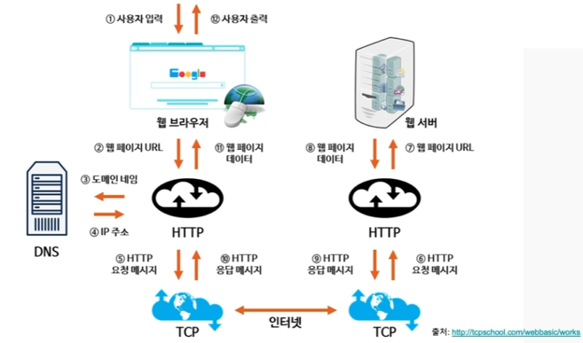

<h1>웹 프로그래밍 개념</h1>

- <b>인터넷과 웹 - 인터넷</b>
- 전 세계적으로 연결되어있는 컴퓨터 네트워크 통신망으로 흔히 <b>웹(World Wide Web)</b> 이라고 함
- 인터넷은 웹, 전자메일, 파일 공유 등 다양한 서비스들을 포함한다.
- 웹의 시초는 아파넷(ARPANET)에서 시작하였는데,
    1969년도에 미국방부 전쟁시 군사 정보가 집중되어 있는 곳이 공격받으면 어쩌지?
    라는 생각에 정보들을 여러 지역에 분산에서 설치하고 연결하자 ! 라는 네트워크 연구에서 시작되었다.
    

- <b>HTML ( Hyper Text Markup Language)</b>
- 프로그래밍 언어라기보단 마크업 언어로, 확장자는 주로 htm,html이며
    그냥 텍스트 파일이지만 브라우저를 만나면 빛을 볼 수 있다.
    

- <b>웹브라우저</b>
- HTML을 비롯하여 이미지, 멀티미디어 파일드으이 콘텐트를 월드와이드 웹을 기반으로 검색 및 뷰잉하기 위한 응용 프로그램이다.
- 최초의 웹 브라우저는 팀버너스리가 Objective-C를 이용하여 NeXTSTEP용으로 개발한 WorldWideWeb.
    이후, 1933년 모자이크 라는 브라우저가 최초로 이미지를 바로 표시할 수 있는 기능을 통해 상용화 성공하였다.
- 모자이크 > 파이어폭스로 계승
- 대표적인 웹 브라우저는 크롬(구글) / 엣지(마이크로소프트) / 사파리(애플) / 파이어폭스(모질라재단) 등이 있다.
    

- <b>웹 접근성</b>
- 장애인 차별 금지 및 권리 구제 등에 관현 법률
- 2009.04.11 부터 공공기관, 특수학교, 종합병원, 복지시설 등과 관련된 웹사이트에서 웹 접근성 보장이 의무화
- 2013부터 모든 법인에서 의무적으로 웹 접근성 준수해야 함
- 장애인 및 고령자 등을 포함한 모든 사람이 다양한 플랫폼 및 장치나 웹 브라우저 등의 모든 환경에서
   차별 및 제한 없이 동등하게 이용할 수 있도록 보장하는 것

- <b>웹 표준과 HTML</b>
- 웹 표준을 지키는 것 -> 웹 접근성을 준수하고 수준을 높이는 것
- 웹 표준 결정 기술은 HTML(마크업 표준 맞추기), CSS(표준 속성 사용), Script(JavaScript)
    

- <b>PC웹과 모바일웹 및 기타 디바이스</b>
- 모바일이 없을 때는 PC만 잘 맞추면 서비스가 가능했으나, 아이폰3GS의 보급에 따라 스마트폰에서 모바일 웹 브라우저를 통해 인터넷 이용이 가능해짐
- 웹 서비스 기업들은 2개의 화면 작업에 대한 이슈 발생(아이폰 VS 갤럭시)
    -> 이후 아이패드와 갤럭시 탭까지 출시
    -> 데이터는 갍으나 표시되는 화면이 각각 달라짐.
    -> <b>이는 프론트엔드와 백엔드로 나눠지는 부분에도 영향을 미침</b>
    

- <b>웹 동작 원리</b>

> 

