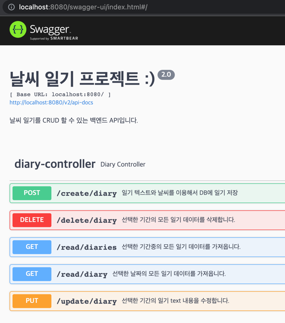

### JAEHYUN weather

## 📢 프로젝트 설명
- 제로베이스 부트캠프 백엔드 스쿨 10기 과제로 진행한 "실전 날씨 일기 프로젝트" 이다.

## ⚙ 개발 환경
- 운영체제 : MacOS
- 통합개발환경(IDE) : IntelliJ
- JDK 버전 : JDK 1.8
- 데이터 베이스 : MySQL
- 빌드 툴 : Gradle
- 관리 툴 : GitHub

## 🔌 Dependencies
- Spring Web
- Spring JPA
- json-simple
- swagger
- mysql-connector
- lombok

## 💻 기술 스택
- 백엔드
    - JAVA, SpringBoot
- 데이터베이스
    - MySQL, Workbench 
  
## 👾 프로젝트 설명
✅ Open Weather Map api 에서 날씨 데이터를 받아 그 날의 날씨와 일기를  
데이터베이스에 함께 저장하는 날씨 일기 프로젝트이다.

## 👾 API 설명
✅ POST / create / diary
- date parameter 로 날짜를 받아 처리한다. (date 형식 : yyyy-MM-dd)
- text parameter 로 일기 글을 받아 처리한다.
- 외부 API 에서 받아온 날씨 데이터와 함께 DB에 저장한다.

✅ GET / read / diary
- date parameter 로 조회할 날짜를 받아 처리한다.
- 해당 날짜의 일기를 List 형태로 반환한다.

✅ GET / read / diaries
- startDate, ednDate parameter 로 조회할 날짜 기간의 시작일/종료일을 받아 처리한다.
- 해당 기간의 일기를 List 형태로 반환한다.

✅ PUT / update / diary
- date parameter 로 수정할 날짜를 받아 처리한다.
- text parameter 로 수정할 새 일기 글을 받아 처리한다.
- 해당 날짜의 첫번째 일기 글을 새로 받아온 일기글로 수정한다.

✅ DELETE / delete / diary
- date parameter 로 삭제할 날짜를 받아 처리한다.
- 해당 날짜의 모든 일기를 지운다.

✅ DB와 관련된 함수들을 트랜잭션 처리 완료. 
✅ 매일 새벽 1시에 날씨 데이터를 외부 API 에서 받아다 DB에 저장해두는 로직 구현완료. 
✅ logback 을 이용하여 프로젝트에 로그를 남기기 구현 완료. 
✅ ExceptionHandler 을 이용한 예외처리 완료. 
✅ swagger 을 이용하여 API documentation 생성. 

## 🌝 느낀점
- 이번 프로젝트는 스프링에 대해 배운 점도 많지만 API 어떻게 사용하고, 어떻게 데이터베이스에 저장하며, 
  트랜잭션, 스케쥴링, 로그 구현, 예외처리, swagger 등 백엔드 개발자라면 꼭 알고 있어야하는 
  내용들에 대한 공부가 되는 시간이였던 것 같다. 이 외에도 배울게 많지만.. 일단 지금 배운 것들 부터 
  완벽하게 깨우치고 다음 단계로 넘어가야겠다고 생각! 

ps.. swagger는 아직 배울게 많다👍 
