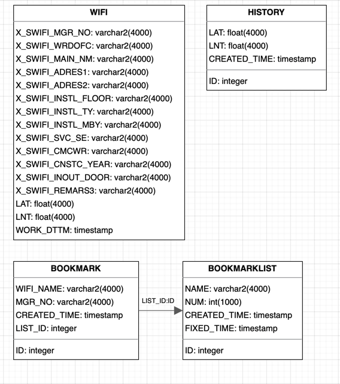
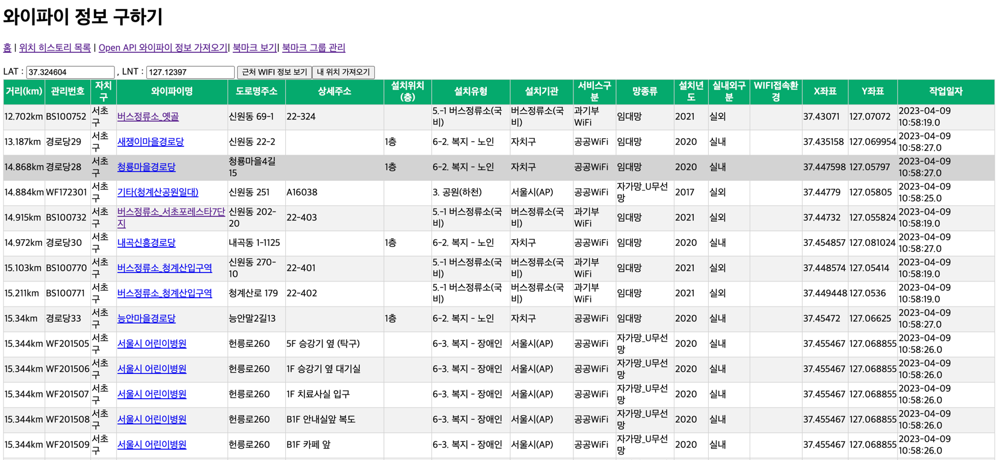
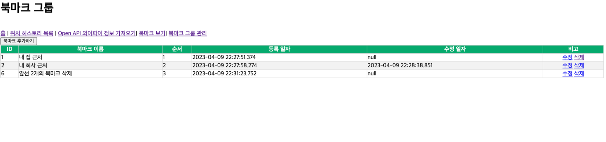
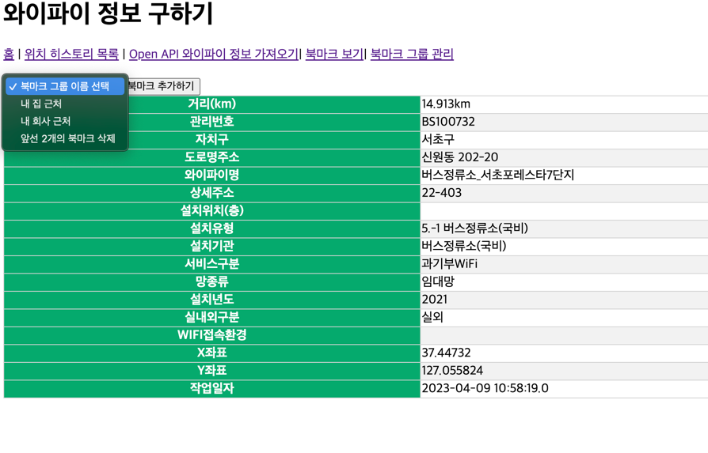
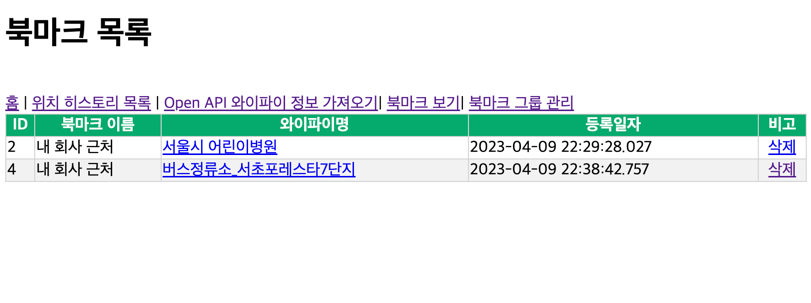
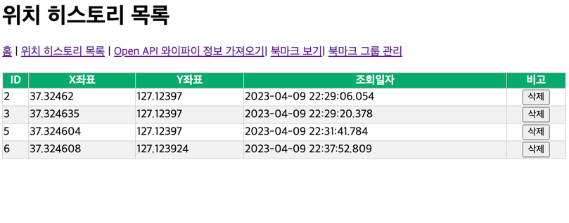

### JAEHYUN WIFI

## 📢 프로젝트 설명
- 제로베이스 부트캠프 백엔드 스쿨 10기 과제로 진행한
  서울시 공공WIFI API를 이용한 “내 위치 기반 공공 와이파이 정보를 제공하는 웹서비스 개발” 이다.

## ⚙ 개발 환경
- 운영체제 :  Windows
- 통합개발환경(IDE) : IntelliJ
- JDK 버전 : JDK 1.8
- 데이터 베이스 : SQLite
- 빌드 툴 : Gradle
- 관리 툴 : GitHub

## 🔌 Dependencies

- jakarta
- servlet-jsp
- Lombok
- okhttp3
- gson
- sqlite-jdbc
- Thymeleaf

## 💻 기술 스택
- 백엔드
    - JAVA, JSP
- 프론트엔드
    - HTML, CSS, Javascript
- 데이터베이스
    - SQLite
    - 

## 👾 프로젝트 설명 
> 인증키는 git에 올리지 않아 clone 받아도 바로 사용 불가능. 인증키는 소중하니 따로 보관. 
  인증키를 내려받아 ApiExplorer에 28번째 줄 "인증키!!!" 부분에 넣기

 
- 내 위치 가져오기를 통해 LAT, LNT 좌표를 GPS를 통해 내려받고, 근처 WIFI 정보 보기를 통해 내 위치와 가장 가까운 20개의 WIFI데이터를 위치순으로 정렬 
(서울시의 WIFI 데이터이기에 본인의 위치인 경기도에서 검색시 가장 가까운 WIFI 12.693km)   

- 북마크 그룹 관리를 통해 들어가 북마크 그룹을 추가 가능
- 한 북마크 그룹 안에는 여러 개의 북마크들 저장 가능
- 북마크 그룹 이름 및 순서 수정/삭제 가능
- JOIN을 통해 북마크 그룹 수정 시 그룹 안에 소속되어 있던 북마크 데이터들 일괄 수정
- JOIN을 통해 북마크 그룹 삭제 시 그룹 안에 소속되어 있던 북마크 데이터들 일괄 삭제  

- WIFI 검색 후 원하는 WIFI명을 클릭한 뒤, select 박스를 클릭 해 원하는 북마크 그룹을 선택한 후 그룹 내에 북마크 저장  

- 북마크 목록을 통해 내가 저장한 북마크들의 북마크 그룹, 와이파이명, 등록일자 확인 가능하며, 원하지 않는 북마크 정보는 삭제 가능
- 북마크 목록에서 WIFI명 클릭시 WIFI의 상세 정보 확인 가능  

- 내가 검색했던 좌표에 대해 history 자동 저장 및 삭제 가능. 

## 🙌 느낀 점
Spring 과 JPA를 이용한 프로젝트만 진행 해 보았는데, JSP, JAVA, RDB 를 이용해서 웹 페이지를 만든다는건 너무나도 힘들었고.. 
프로젝트도 1주일이면 끝날 것 같았지만 두배는 걸린 듯.. OPEN API를 내려받아보는 경험은 해 보았으나, 
직접 데이터베이스에 넣어 데이터들을 통해 CRUD 및 북마크 저장 등 부가적인 학습은 해보지 않았던 터라 너무나도 힘들었지만, 데이터 하나하나가 화면에 뜰 때 마다 짜릿하긴 했다..^^ 
역시 콘솔 안에 갇혀 사는 것 보단 내가 짜놓은 틀에 내가 원하는 데이터가 들어가는걸 보는게 가장 재미있다는걸 다시 한 번 느끼게 해 준 프로젝트인 것 같다. 
(jsp, rdb는 처음 사용 해 본거라 이 프로젝트를 통해 진짜진짜 알게된 건 많지만 코드가 많이 지저분하고 쓸모없는 코드가 많이 껴있을 것으로 예상..^^;)